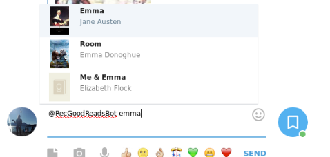
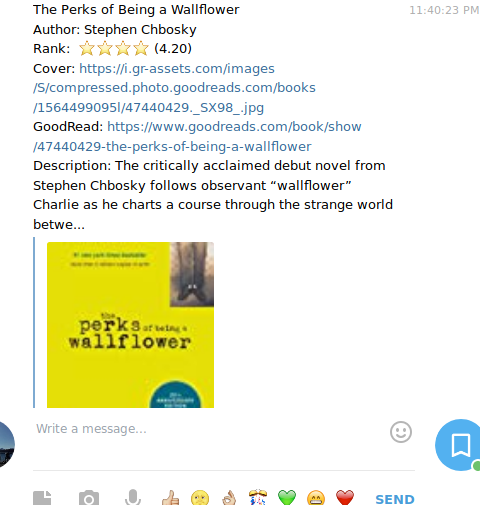

# GoodReads Bot

Recomendarle libros a tus amigos nunca fue tan sencillo! 

Simplemente debes buscar el libro que quiere recomendar 
comenzando con @RecGoodReadsBot 

  

Podrás ver en tu submenú de opciones la tapa, el título y el escritor del libro. Cuando encuentres el que quieras recomendar, siemplemente seleccionalo y toda la información de este será enviada al chat.

  
    
Podrán ver la información más importante, como la puntuación, descripción y portada que le dió GoodReads. Finalmente, se da también el link, para ver el perfil completo del libro.

---
PD: Este fue también un espacio para recomendar: 
* 'Emma' de Jane Austen 
* 'The Perks of Being a Wallflower" de Stephen Chbosky (la película es muy buena también)
---
